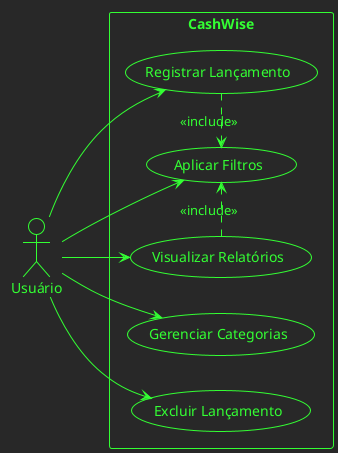
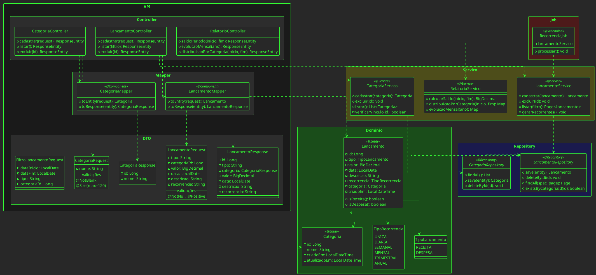
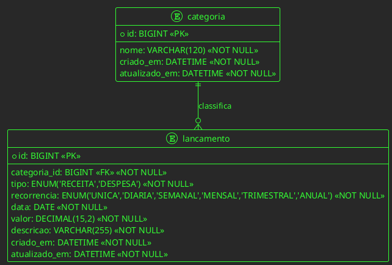

# 📄 CashWise – Documentação do MVP

**Mais controle, menos desperdício.**

---

## Sumário

1. [Apresentação](#apresentação)  
2. [Descrição do Projeto](#descrição-do-projeto)  
3. [Escopo do MVP](#escopo-do-mvp)  
4. [Observações](#observações)  
5. [Necessidades Observadas e Regras de Negócio](#necessidades-observadas-e-regras-de-negócio)  
6. [Requisitos Funcionais](#requisitos-funcionais)  
7. [Requisitos Não Funcionais](#requisitos-não-funcionais)  
8. [Diagramas UML](#diagramas-uml)  
9. [Conclusão](#conclusão)  

---

## Apresentação

A **Plataforma de Controle Financeiro Pessoal – CashWise** é um sistema **web full-stack** composto por:

- **Back-end**: Java 17 + Spring Boot 3 – API REST  
- **Front-end**: Bootstrap + Alpine.js + jQuery (responsivo, mobile-first)

**Objetivo**: Permitir que o usuário registre receitas/despesas, categorize-as, defina recorrências e visualize **relatórios financeiros** em dashboards automáticos, sem exportação no MVP.

---

## Descrição do Projeto

O usuário registra **lançamentos** informando:
- Valor (em Real – BRL)
- Categoria (pré-cadastrada)
- Recorrência (obrigatória – 6 opções fixas)
- Data (padrão: data atual)
- Descrição (obrigatória)

Os dados são exibidos em **listagens filtráveis** e em **página de relatórios** com gráficos de saldo, evolução mensal e distribuição por categoria.

---

## Escopo do MVP

| Módulo | Funcionalidades Entregues |
|--------|---------------------------|
| **Categorias** | CRUD completo. Exclusão **só** é permitida quando **não há lançamentos vinculados**. |
| **Lançamentos** | Cadastro, exclusão, listagem **paginada** com **8 filtros** (período, tipo, categoria, recorrência, faixa de valor, descrição). **Edição NÃO existe no MVP**. |
| **Recorrência** | 6 tipos fixos: `UNIQUE`, `DAILY`, `WEEKLY`, `MONTHLY`, `QUARTERLY`, `ANUAL`.<br>Job diário (01:00) gera **no máximo 2 filhos/dia** respeitando `recurrencyEndDate` e flag `ativo`. |
| **Relatórios** | 3 consultas instantâneas: balancete, distribuição % por categoria e evolução mensal de um ano. <br>**Sem exportação no MVP**. |

---

## Observações

- Moeda única: **Real (BRL)**  
- Categorias são **compartilhadas** entre receitas e despesas (simplificação do MVP)  
- Lançamentos com recorrência ≠ `UNIQUE` geram **cópias automáticas** (filhos)  
- **Automação**: Job Spring `@Scheduled` processa recorrências diariamente  
- **Validações**: Bean Validation (`@Valid`) em **todos** os DTOs de entrada  
- **Auditoria**: campos `createdAt`/`updatedAt` preenchidos automaticamente pelo JPA

---

## Necessidades Observadas e Regras de Negócio

### Necessidades
- Controle **unificado** de receitas e despesas  
- Classificação por **categorias**  
- Relatórios **visuais** para análise rápida da situação financeira  

### Regras de Negócio
RN01. Todo lançamento **deve** estar vinculado a uma **categoria existente**.  
RN02. Valor **> 0** e **≤ 9.999.999.999.999,99** (13 inteiros + 2 decimais).  
RN03. Recorrência é **obrigatória** e **fixa** (somente valores do enum).  
RN04. Lançamentos **não podem ser editados** – apenas **excluídos**.  
RN05. Categoria só é removida se **nenhum** lançamento estiver associado.  
RN06. Filhos gerados têm `recurrencyActive = false` e `parentTransactionId` apontando para o original.  
RN07. Job **não gera mais de 2 filhos por dia** para cada original e **nunca** após `recurrencyEndDate`.

---

## Requisitos Funcionais

| ID | Descrição |
|----|-----------|
| RF01 | CRUD de **Categorias** (id e nome). Exclusão bloqueada se houver lançamentos vinculados. |
| RF02 | CRUD de **Lançamentos** (receitas/despesas). **Edição não permitida** no MVP. |
| RF03 | Selecionar **recorrência fixa** no lançamento. Se ≠ `UNICA`, gerar automaticamente lançamentos futuros. |
| RF04 | Listar lançamentos com **filtros** (período, tipo, categoria, recorrência, valor, descrição) e **paginação**. |
| RF05 | Visualizar **relatórios web**: Saldo no período, Evolução mensal, Distribuição por categoria. **Sem exportação no MVP**. |
| RF06 | Registrar **metadados de auditoria** (`createdAt`, `updatedAt`). |
| RF07 | Validar dados de entrada usando **`@Valid`** nos DTOs antes de processar no Controller. |

---

## Requisitos Não Funcionais

- **Arquitetura**: Spring Boot (REST) – camadas `controller → dto → service → domain → repository`  
- **Banco**: MySQL 8+ com Spring JPA (Hibernate) – geração de tabelas via `ddl-auto=update`  
- **Validação**: Uso **obrigatório** de `@Valid` nos DTOs para validação de entradas  
- **Interface**: Responsiva (Bootstrap), mobile-first; acessibilidade básica (aria-labels)  
- **Ambiente**: Localhost:8080 (back-end) e localhost:3000 (front-end)  
- **Compatibilidade**: Chrome/Firefox/Edge atuais  
- **DTO Pattern**: Separados do modelo de domínio – desacoplamento e segurança de dados  
- **Automação**: Job agendado para processar lançamentos recorrentes (gerar futuros automaticamente)  
- **Integridade**: Validação **obrigatória** antes de excluir categorias (verificar vínculos)

---

## 7. Diagramas UML

### 7.1 Diagrama de Casos de Uso



### 7.2 Diagrama de Classes



### 7.3 Diagrama EER



**Índices recomendados para `lancamento`**:
- `idx_lan_data` (data)
- `idx_lan_categoria` (categoria_id)
- `idx_lan_tipo` (tipo)
- `idx_lan_data_tipo` (data, tipo)

---

## 8. Estrutura de Pacotes

```
com.cashwise/
├── api/
│   ├── controller/
│   │   ├── CategoriaController.java
│   │   ├── LancamentoController.java
│   │   └── RelatorioController.java
│   ├── dto/
│   │   ├── request/
│   │   │   ├── CategoriaRequest.java
│   │   │   ├── LancamentoRequest.java
│   │   │   └── FiltroLancamentoRequest.java
│   │   └── response/
│   │       ├── CategoriaResponse.java
│   │       ├── LancamentoResponse.java
│   │       └── RelatorioResponse.java
│   └── mapper/
│       ├── CategoriaMapper.java
│       └── LancamentoMapper.java
├── domain/
│   ├── entity/
│   │   ├── Categoria.java
│   │   └── Lancamento.java
│   └── enums/
│       ├── TipoLancamento.java
│       └── TipoRecorrencia.java
├── repository/
│   ├── CategoriaRepository.java
│   └── LancamentoRepository.java
├── service/
│   ├── CategoriaServico.java
│   ├── LancamentoServico.java
│   └── RelatorioServico.java
├── job/
│   └── RecorrenciaJob.java
└── CashWiseApplication.java
```

---

## Conclusão

O MVP do CashWise entrega todas as funcionalidades essenciais de um controle financeiro pessoal, com automação de recorrências, relatórios visuais e validações robustas, mantendo simplicidade e prontidão para evolução.

### Princípios de Design

- **KISS** (Keep It Simple, Stupid): Modelo simplificado, sem complexidades desnecessárias
- **YAGNI** (You Aren't Gonna Need It): Apenas funcionalidades essenciais para o MVP
- **SOLID**: Principalmente SRP (Single Responsibility Principle) na separação de serviços
- **Object Calisthenics**: Boas práticas de design orientado a objetos
- **DTO Pattern**: Separação clara entre API externa e modelo de domínio interno

### Benefícios da Arquitetura

- Desacoplamento total entre camadas – permite evoluir modelo de domínio sem quebrar contratos da API
- Validação específica para entradas – evita inconsistências e vazamento de dados internos
- Paginação obrigatória – impede OutOfMemory em grandes volumes
- Job idempotente – limite de 2 filhos/dia e uso da última data gerada como base elimina duplicidades
- Auditoria automática – rastreabilidade sem código extra
- Prontidão para escalar – API stateless, pronta para containerização e CI/CD
