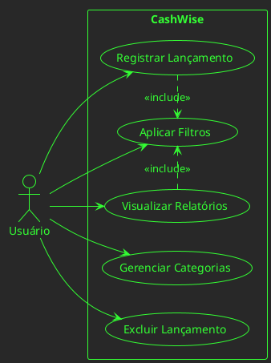
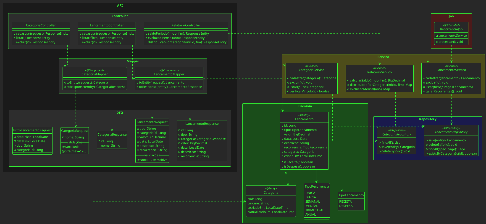
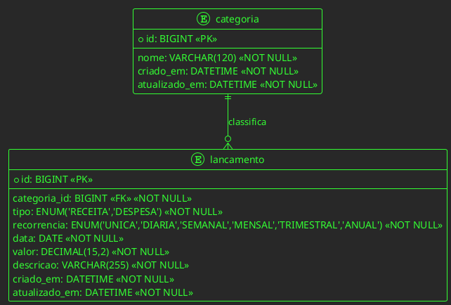

# 📄 CashWise – Documentação do MVP

**Mais controle, menos desperdício.**

## Sumário

1. [Apresentação](#apresentação)
2. [Descrição do Projeto](#descrição-do-projeto)
3. [Escopo do MVP](#escopo-do-mvp)
4. [Necessidades e Regras de Negócio](#necessidades-observadas-e-regras-de-negócio)
5. [Requisitos Funcionais](#requisitos-funcionais)
6. [Requisitos Não Funcionais](#requisitos-não-funcionais)
7. [Diagramas UML](#diagramas-uml)
8. [Estrutura de Pacotes](#estrutura-de-pacotes)

---

## 1. Apresentação

A **Plataforma de Controle Financeiro Pessoal – CashWise** é um sistema web com:
- **Back-end**: Java (Spring Boot) - API REST
- **Front-end**: Bootstrap / Alpine.js / jQuery

**Objetivo**: Registrar e analisar receitas e despesas, com categorização e relatórios visuais para apoiar decisões financeiras pessoais.

---

## 2. Descrição do Projeto

O usuário registra lançamentos (receitas/despesas) informando:
- Valor (em Real - BRL)
- Categoria (previamente cadastrada)
- Recorrência (obrigatória, entre opções fixas do sistema)
- Data (padrão: data atual)
- Descrição (obrigatória)

Os dados são exibidos em listagens filtráveis e em uma página de relatórios com dashboards visuais.

---

## 3. Escopo do MVP

- CRUD de **Categorias** (id e nome)
- CRUD de **Lançamentos** (Receita/Despesa) com recorrência fixa
- Listagem de lançamentos com filtros (período, tipo, categoria) e paginação
- Página de **Relatórios** com gráficos:
  - Saldo no período
  - Evolução mensal
  - Distribuição por categoria

### Observações
- Relatórios visualizados apenas na interface web (sem exportação no MVP)
- Moeda única: todos os valores em Real (BRL)
- Lançamentos com recorrência diferente de `UNICA` geram automaticamente lançamentos futuros
- Categorias são compartilhadas entre receitas e despesas (simplificação do MVP)

---

## 4. Necessidades Observadas e Regras de Negócio

### Necessidades
- Controle unificado de receitas e despesas
- Classificação por categorias
- Relatórios visuais para análise rápida da situação financeira

### Regras de Negócio
- Todo lançamento deve estar vinculado a uma categoria
- Cada lançamento exige: tipo (receita/despesa), valor (> 0), categoria, data (padrão: hoje), recorrência e descrição
- Recorrência é obrigatória e fixa: `UNICA`, `DIARIA`, `SEMANAL`, `MENSAL`, `TRIMESTRAL`, `ANUAL`
- A recorrência é definida pelo sistema (não personalizável pelo usuário)
- **Automação de Recorrência**: Quando a recorrência for diferente de `UNICA`, o sistema deve gerar automaticamente os próximos lançamentos conforme a periodicidade escolhida
- Lançamentos não podem ser editados, apenas excluídos (regra do MVP)
- **Exclusão de Categoria**: Uma categoria só pode ser excluída se não houver lançamentos vinculados a ela. O sistema deve validar esta regra antes de permitir a exclusão
- Todos os valores monetários são em Real (BRL) no MVP
- Categorias são entidades simples com apenas id e nome, utilizáveis tanto para receitas quanto para despesas (compartilhadas no MVP)
- **Validações**: Todas as validações de negócio ocorrem entre o DTO e Controller através da anotação `@Valid`

---

## 5. Requisitos Funcionais

| ID | Descrição |
|----|-----------|
| RF01 | Cadastrar/excluir categorias (apenas id e nome). Exclusão bloqueada se houver lançamentos vinculados |
| RF02 | Cadastrar/excluir lançamentos (receitas e despesas). Edição não permitida no MVP |
| RF03 | Selecionar recorrência fixa no lançamento. Se diferente de `UNICA`, gerar automaticamente lançamentos futuros |
| RF04 | Listar lançamentos com filtros (período, tipo, categoria) e paginação |
| RF05 | Visualizar relatórios na interface web (sem exportação no MVP): Saldo no período, Evolução mensal, Distribuição por categoria |
| RF06 | Registrar metadados de auditoria mínimos (criado_em, atualizado_em) |
| RF07 | Validar dados de entrada usando `@Valid` nos DTOs antes de processar no Controller |

---

## 6. Requisitos Não Funcionais

- **Arquitetura**: Spring Boot (REST), camadas controller → dto → service → domain → repository
- **Banco de Dados**: MySQL 8+ com Spring JPA (Hibernate), criação de tabelas a partir das entidades
- **Validação**: Uso obrigatório de anotações `@Valid` nos DTOs para validação de entradas antes do processamento no Controller
- **Usabilidade**: Interface responsiva (Bootstrap), mobile first; acessibilidade básica (aria-labels)
- **Ambiente**: Aplicação rodando em localhost:8080 (back-end) e localhost:3000 (front-end)
- **Compatibilidade**: Navegadores Chrome/Firefox/Edge atuais
- **Separação de Responsabilidades**: Uso de DTOs para request/response, separados do modelo de domínio
- **Automação**: Job agendado para processar lançamentos recorrentes (gerar lançamentos futuros automaticamente)
- **Integridade Referencial**: Validação obrigatória antes de excluir categorias (verificar se há lançamentos vinculados)

---

## 7. Diagramas UML

### 7.1 Diagrama de Casos de Uso



### 7.2 Diagrama de Classes



### 7.3 Diagrama EER



**Índices recomendados para `lancamento`**:
- `idx_lan_data` (data)
- `idx_lan_categoria` (categoria_id)
- `idx_lan_tipo` (tipo)
- `idx_lan_data_tipo` (data, tipo)

---

## 8. Estrutura de Pacotes

```
com.cashwise/
├── api/
│   ├── controller/
│   │   ├── CategoriaController.java
│   │   ├── LancamentoController.java
│   │   └── RelatorioController.java
│   ├── dto/
│   │   ├── request/
│   │   │   ├── CategoriaRequest.java
│   │   │   ├── LancamentoRequest.java
│   │   │   └── FiltroLancamentoRequest.java
│   │   └── response/
│   │       ├── CategoriaResponse.java
│   │       ├── LancamentoResponse.java
│   │       └── RelatorioResponse.java
│   └── mapper/
│       ├── CategoriaMapper.java
│       └── LancamentoMapper.java
├── domain/
│   ├── entity/
│   │   ├── Categoria.java
│   │   └── Lancamento.java
│   └── enums/
│       ├── TipoLancamento.java
│       └── TipoRecorrencia.java
├── repository/
│   ├── CategoriaRepository.java
│   └── LancamentoRepository.java
├── service/
│   ├── CategoriaServico.java
│   ├── LancamentoServico.java
│   └── RelatorioServico.java
├── job/
│   └── RecorrenciaJob.java
└── CashWiseApplication.java
```

---

## Conclusão

Esta documentação define o escopo do MVP da plataforma **CashWise**, um sistema de controle financeiro pessoal focado em simplicidade e usabilidade. O sistema permite gerenciar categorias, registrar lançamentos com recorrência fixa e visualizar relatórios financeiros de forma clara e objetiva.

### Princípios de Design

- **KISS** (Keep It Simple, Stupid): Modelo simplificado, sem complexidades desnecessárias
- **YAGNI** (You Aren't Gonna Need It): Apenas funcionalidades essenciais para o MVP
- **SOLID**: Principalmente SRP (Single Responsibility Principle) na separação de serviços
- **Object Calisthenics**: Boas práticas de design orientado a objetos
- **DTO Pattern**: Separação clara entre API externa e modelo de domínio interno

### Benefícios da Arquitetura

A arquitetura em camadas com DTOs específicos proporciona:
- Desacoplamento entre API e domínio
- Validação específica para entradas da API
- Flexibilidade para evolução do modelo de domínio sem impactar a API
- Segurança ao expor apenas os dados necessários nas respostas
